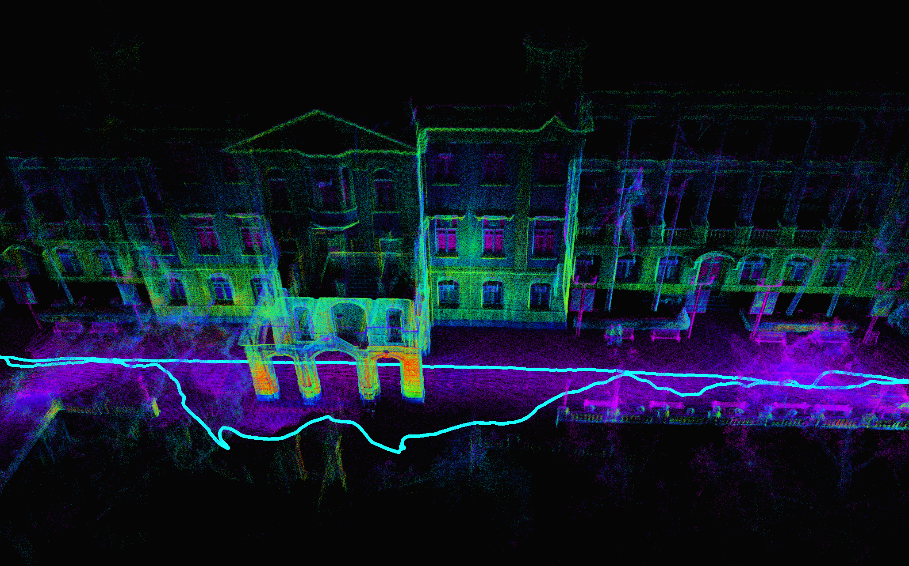

# My_FastLIO

<div align="center">
  
</div>

Language: [中文](README.md) | English

---

## 🧭 Introduction

This is a Lidar-Inertial Odometry (LIO) system based on the IESKF framework. We implemented a "composite manifold" structure using templates to support different $\boxplus$ and $\boxminus$ operators for state updates. For details, see the paper: [Kalman Filters on Differentiable Manifolds](https://arxiv.org/pdf/2102.03804).

Our IESKF implementation mainly follows [FAST-LIO2](https://arxiv.org/pdf/2107.06829). You can refer to the following documents for the derivation of key equations:

- [Forward Propagation](src/my_fastlio/doc/前向传播.md)
- [State Update](src/my_fastlio/doc/观测模型推导.md)

We have experimented with several observation models, including:

- Point-to-plane (used in FAST-LIO)
- [IVGICP-based model](src/my_fastlio/doc/VGICP观测.md)
- [Probabilistic voxel map model](src/my_fastlio/doc/概率体素地图下的观测和状态更新.md)

---

## 📦 Dependencies

- Ubuntu 18.04
- ROS (not required for core logic, only for visualization)
- Eigen ≥ 3.3.7
- PCL ≥ 1.10
- [livox_ros_driver](https://github.com/Livox-SDK/livox_ros_driver)

---

## 🛠️ Build Instructions

```bash
mkdir -p catkin_ws/src
cd catkin_ws/src
git clone git@github.com:GDTR12/my_fastlio.git
cd ..
catkin_make
```

## 🚀 Running the System
Supported LiDAR sensors:
- Livox Avia
- Other rotating LiDARs

Tested datasets:
- [University of Hong Kong Main Building](https://drive.google.com/drive/folders/1CGYEJ9-wWjr8INyan6q1BZz_5VtGB-fP)
- [LIO-SAM handheld dataset](https://drive.google.com/drive/folders/1gJHwfdHCRdjP7vuT556pv8atqrCJPbUq)

```bash
source devel/setup.bash
roslaunch my_fastlio my_fast_lio.launch
```

## 📌 Upcoming Improvements
The current code is still under development and lacks robustness. We are actively working on enhancements — stay tuned!
