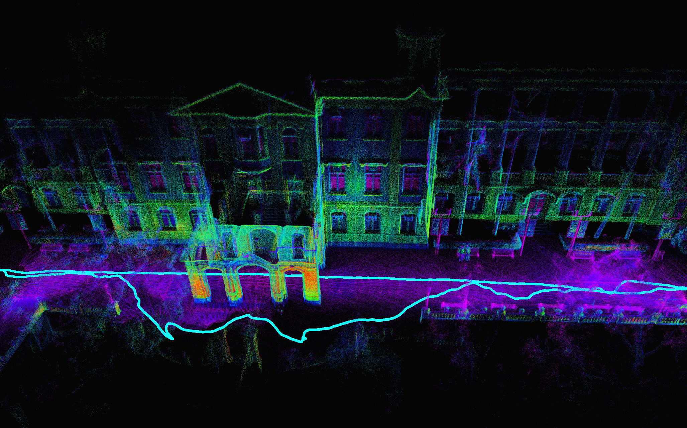

# My_FastLIO

<div align="center">
  
</div>

语言: 中文 | [English](README.md)

---

## 🧭 项目简介

本项目实现了一个基于 IESKF 框架的 LIO（Lidar-Inertial Odometry）系统。我们自定义了组合流形结构，并通过模板实现了不同流形下的 $\boxplus$ 和 $\boxminus$ 操作，供 IESKF 使用。相关理论可参考论文：[Kalman Filters on Differentiable Manifolds](https://arxiv.org/pdf/2102.03804)。

IESKF 实现主要参考 [FAST-LIO2](https://arxiv.org/pdf/2107.06829)。部分公式推导可参考以下文档：

- [前向传播](src/my_fastlio/doc/前向传播.md)
- [状态更新](src/my_fastlio/doc/观测模型推导.md)

目前支持的观测模型包括：

- point-to-plane（即 FAST-LIO 所用模型）
- [IVGICP](src/my_fastlio/doc/VGICP观测.md)
- [概率体素地图](src/my_fastlio/doc/概率体素地图下的观测和状态更新.md) 实测很多环境无法跑通

---

## 📦 依赖环境

- Ubuntu 18.04
- ROS（核心模块不依赖 ROS，仅用于可视化）
- Eigen ≥ 3.3.7
- PCL ≥ 1.10
- [livox_ros_driver](https://github.com/Livox-SDK/livox_ros_driver)

---

## 🛠️ 编译方式

```bash
mkdir catkin_ws
cd catkin_ws
git clone git@github.com:GDTR12/my_fastlio.git
catkin_make
```

## 3. 🚀 运行
目前支持的激光雷达:
- livox_avia
- 其他旋转激光雷达

```bash
source devel/setup.bash
roslaunch my_fastlio my_fast_lio.launch
```

目前测试的数据集:
- [香港大学主建筑](https://drive.google.com/drive/folders/1CGYEJ9-wWjr8INyan6q1BZz_5VtGB-fP)
- [LIO-SAM手持数据集](https://drive.google.com/drive/folders/1gJHwfdHCRdjP7vuT556pv8atqrCJPbUq)

## 4. 期待更新
目前代码仍在持续优化中，尚未具备良好的鲁棒性。我们将持续完善，敬请期待后续版本！