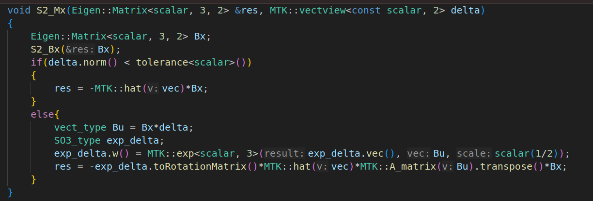

# 前向传播
论文中给出的公式的前向传播公式为：
$$
\begin{equation}
  \begin{aligned}
    \mathrm{x}\triangleq
    \begin{bmatrix}
    ^{G}\mathrm{R}_{I}^{T} & ^{G}\mathrm{p}_{I}^{T} & ^{G}\mathrm{v}_{I}^{T} & \mathrm{b}_{\boldsymbol{\omega}}^{T} & \mathbf{b}_{\mathbf{a}}^{T} & ^{G}\mathbf{g}^{T} & ^{I}\mathbf{R}_{L}^{T} & ^{I}\mathbf{p}_{L}^{T}
    \end{bmatrix}^{T}\in\mathcal{M} \\

    \mathbf{f}\left(\mathbf{x},\mathbf{u},\mathbf{w}\right)=
    \begin{bmatrix}
    \boldsymbol{\omega}_m-\mathbf{b}_\mathbf{\omega}-\mathbf{n}_\mathbf{\omega} \\
    ^G\mathbf{v}_I+\frac{1}{2}\left(^G\mathbf{R}_I\left(\mathbf{a}_m-\mathbf{b}_\mathbf{a}-\mathbf{n}_\mathbf{a}\right)+^G\mathbf{g}\right)\Delta t \\
    ^G\mathbf{R}_I\left(\mathbf{a}_m-\mathbf{b}_\mathbf{a}-\mathbf{n}_\mathbf{a}\right)+^G\mathbf{g} \\
    \mathbf{n}_{\mathbf{b}_{\boldsymbol{\omega}}} \\
    \mathbf{n}_\mathbf{b_{\mathbf{a}}} \\
    \mathbf{0}_{3\times1} \\
    \mathbf{0}_{3\times1} \\
    \mathbf{0}_{3\times1}

    \end{bmatrix}\in\mathbb{R}^{24}
  \end{aligned}
\end{equation}
$$

为了和代码中的版本对应稍微更改一下顺序, 同时让 ${}^{G}\mathbf{g} \in \mathbf{S}^{2}(r)$ 这里 $r = 9.81$ ：
$$
\begin{equation}
  \begin{aligned}

    \mathrm{x}\triangleq
    \begin{bmatrix}
     ^{G}\mathrm{p}_{I}^{T} & ^{G}\mathrm{R}_{I}^{T} & ^{I}\mathbf{R}_{L}^{T} & ^{I}\mathbf{p}_{L}^{T} & ^{G}\mathrm{v}_{I}^{T} & \mathrm{b}_{\boldsymbol{\omega}}^{T} & \mathbf{b}_{\mathbf{a}}^{T} & ^{G}\mathbf{g}^{T}
    \end{bmatrix}^{T}\in\mathcal{M}\\

    \mathbf{f}\left(\mathbf{x},\mathbf{u},\mathbf{w}\right)=
    \begin{bmatrix}
        ^G\mathbf{v}_I+\frac{1}{2}\left(^G\mathbf{R}_I\left(\mathbf{a}_m-\mathbf{b}_\mathbf{a}-\mathbf{n}_\mathbf{a}\right)+ {}^G\mathbf{g}\right)\Delta t \\
        \boldsymbol{\omega}_m-\mathbf{b}_\mathbf{\omega}-\mathbf{n}_\mathbf{\omega}\\
        \mathbf{0}_{3\times1} \\
        \mathbf{0}_{3\times1} \\
        ^G\mathbf{R}_I\left(\mathbf{a}_m-\mathbf{b}_\mathbf{a}-\mathbf{n}_\mathbf{a}\right)+^G\mathbf{g} \\
        \mathbf{n}_{\mathbf{b}_{\boldsymbol{\omega}}} \\
        \mathbf{n}_\mathbf{b_{\mathbf{a}}} \\
        \mathbf{0}_{2\times1}
    \end{bmatrix} \in \mathbb{R}^{23}
  \end{aligned}
\end{equation}
$$

名义状态变量前向传播公式为:
$$
\begin{equation}
  \begin{aligned}
    \widehat{\mathbf{x}}_{i+1}=\widehat{\mathbf{x}}_i\boxplus(\Delta t\mathbf{f}(\widehat{\mathbf{x}}_i,\mathbf{u}_i,\mathbf{0}));\widehat{\mathbf{x}}_0=\bar{\mathbf{x}}_{k-1}.
  \end{aligned}
\end{equation}
$$

误差状态变量则可以根据上式通过 $\widetilde{\mathbf{x}}_{i+1} = \mathbf{x}_{i+1} \boxminus \hat{\mathbf{x}}_{i+1}$ 求得为：
$$
\begin{equation}
  \begin{aligned}
    \widetilde{\mathbf{x}}_{i+1} &= \left(\mathbf{x}_{i} \boxplus \Delta t \mathbf{f}\left(\mathbf{x}_{i}, \mathbf{u}_{i}, \mathbf{w}_{i}\right)\right) \boxminus\left(\widehat{\mathbf{x}}_{i} \boxplus \Delta t \mathbf{f}\left(\widehat{\mathbf{x}}_{i}, \mathbf{u}_{i}, \mathbf{0}\right)\right)
  \end{aligned}
\end{equation}
$$

易求得：
$$
\begin{equation}
  \begin{aligned}
    \widetilde{\mathbf{x}}_{i+1} = 
    \begin{bmatrix}
        ^{G}\mathrm{p}_{I_i} - ^{G}\hat{\mathrm{p}}_{I_i} + \Delta{t} \left[ ^G\mathbf{v}_{I_i} - ^G\hat{\mathbf{v}}_{I_i} + \frac{1}{2}\Delta t \left[\left(^G\mathbf{R}_{I_i} \left( \mathbf{a}_{m_i}-\mathbf{b}_{\mathbf{a}_{i}}-\mathbf{n}_{\mathbf{a}_i}\right)\right) - \left( ^G\hat{\mathbf{R}}_{I_i} \left(\mathbf{a}_{m_i}-\hat{\mathbf{b}}_{\mathbf{a}_i}\right) \right) + {}^G\mathbf{g}_{i} - {}^G\hat{\mathbf{g}}_{i} \right] \right] \\

        \left[  ^{G}\mathrm{R}_{I_i} \mathbf{Exp}(\Delta{t}(\boldsymbol{\omega}_{m_i}-\mathbf{b}_{\mathbf{\omega}_i}-\mathbf{n}_{\mathbf{\omega}_i})) \right] \boxminus \left[  ^{G}\hat{\mathrm{R}}_{I_i} \mathbf{Exp}(\Delta{t}(\boldsymbol{\omega}_{m_i}-\hat{\mathbf{b}}_{\mathbf{\omega}_i})) \right] \\

        ^{I}\mathbf{R}_{L_i}^{T} \boxminus ^{I}\hat{\mathbf{R}}_{L_i}^{T}\\

        ^{I}\mathbf{p}_{L_i}^{T} - ^{I}\hat{\mathbf{p}}_{L_i}^{T} \\

        ^{G}\mathrm{v}_{I_i} - ^{G}\hat{\mathrm{v}}_{I_i} + \Delta{t} \left[ ^G\mathbf{R}_{I_i}\left(\mathbf{a}_{m_i}-\mathbf{b}_{\mathbf{a}_i}-\mathbf{n}_{\mathbf{a}_i} \right) - ^G\hat{\mathbf{R}}_{I_i}\left(\mathbf{a}_{m_i}-\hat{\mathbf{b}}_{\mathbf{a}_i} \right) + ^G\mathbf{g}_i - ^G\hat{\mathbf{g}}_i \right]\\

        \mathbf{b}_{\mathbf{\omega}_i} - \hat{\mathbf{b}}_{\mathbf{\omega}_i} + \Delta{t} \mathbf{n}_{\mathbf{b}_{\mathbf{\omega}_i}} \\
        
        \mathbf{b}_{\mathbf{a}_i} - \hat{\mathbf{b}}_{\mathbf{a}_i} + \Delta{t}  \mathbf{n}_{\mathbf{b}_{\mathbf{a}_i}} \\

        ^G\mathbf{g}_i \boxminus {}^G\hat{\mathbf{g}}_i

    \end{bmatrix}
  \end{aligned}
\end{equation}
$$

上式基本能看出从 $\widetilde{\mathbf{x}}_{i}$ 到 $\widetilde{\mathbf{x}}_{i+1}$ 的递推过程, 例如 $^{G}\mathrm{p}_{I_i} - ^{G}\hat{\mathrm{p}}_{I_i}$ 对 $\mathbf{\widetilde{p}}$ 的偏导数为 $\mathbf{I}$, $^{I}\mathbf{R}_{L_i}^{T} \boxminus ^{I}\hat{\mathbf{R}}_{L_i}^{T}$ 对 $\mathbf{\widetilde{\theta}}$ 的偏导数为 $\mathbf{I}$ ,但是其中第1、2、5项目并不能直接求得到，下面我们专门推导这几项目。

对于第1项和第5项，核心都是 $ ^G\mathbf{R}_{I_i}\left(\mathbf{a}_{m_i}-\mathbf{b}_{\mathbf{a}_i}-\mathbf{n}_{\mathbf{a}_i} \right) - ^G\hat{\mathbf{R}}_{I_i}\left(\mathbf{a}_{m_i}-\hat{\mathbf{b}}_{\mathbf{a}_i} \right)$, 求对 $\delta{\mathbf{b}_{a_i}}$ 的偏导时, $\delta{\mathbf{\theta}} = 0$ ,因此很容易求出来为 $- ^G\hat{\mathbf{R}}_{I_i}$, 

同理可求对 $\mathbf{n}_{\mathbf{a}_i}$ 的偏导数.

求对 $\delta{\mathbf{\theta}}$ 的偏导数时, $ \delta{\mathbf{b}_{a_i}} = 0,  \mathbf{n}_{\mathbf{a}_i} = 0 $ 也容易求得偏导为 
$$
\begin{equation}
  \begin{aligned}
    原式 = ^G\hat{\mathbf{R}}_{I_i} \left( \mathbf{Exp}(\mathbf{\delta{\theta}}) - \mathbf{I} \right) \left(\mathbf{a}_{m_i}-\hat{\mathbf{b}}_{\mathbf{a}_i} \right)
  \end{aligned}
\end{equation}
$$
故容易求得对 $\delta{\mathbf{\theta}}$ 的偏导数为 $-^G\hat{\mathbf{R}}_{I_i} \left[\mathbf{a}_{m_i}-\hat{\mathbf{b}}_{\mathbf{a}_i} \right]_{\times} $
 (右扰动)
<!-- $$
\begin{equation}
  \begin{aligned}

    \mathbf{R}  \mathbf{Exp}(\mathbf{\delta{\theta}}) - \mathbf{R} &= \mathbf{R}(\mathbf{Exp}(\mathbf{\delta{\theta}}) - \mathbf{I})\\
    % &\overset{小量近似}{=} - \mathbf{R} ( \mathbf{I} - [\mathbf{\delta{\theta}}]_{\times} )

  \end{aligned}
\end{equation}
$$:

因此：

$$
\begin{equation}
  \begin{aligned}
    包含 \mathbf{a}_{m_i} 的项 &= {}^G\hat{\mathbf{R}}_{I_i} ( \mathbf{Exp}(\delta{\theta}) - \mathbf{I} ) \mathbf{a}_{m_i} \\
    &= {}^G\hat{\mathbf{R}}_{I_i} [\mathbf{\delta{\theta}}]_{\times} \mathbf{a}_{m_i} - {}^G\hat{\mathbf{R}}_{I_i} \mathbf{a}_{m_i} \\
    &= -{}^G\hat{\mathbf{R}}_{I_i} [\mathbf{a}_{m_i}]_{\times} \mathbf{\delta{\theta}} - {}^G\hat{\mathbf{R}}_{I_i} \mathbf{a}_{m_i}
  \end{aligned}
\end{equation}
$$
$$
\begin{equation}
  \begin{aligned}
   其包含 \mathbf{b}_{a} 的项 ^G\hat{\mathbf{R}}_{I_i} \hat{\mathbf{b}}_{\mathbf{a}_i} - ^G\mathbf{R}_{I_i} \mathbf{b}_{\mathbf{a}_i} &= {}^G\hat{\mathbf{R}}_{I_i} \hat{\mathbf{b}}_{\mathbf{a}_i} - ^G\hat{\mathbf{R}}_{I_i} \mathbf{Exp}(\mathbf{\delta{\theta}}) ( \hat{\mathbf{b}}_{\mathbf{a}_i} + \mathbf{\delta{b}} ) \\ 
    &\overset{小量近似}{=} {}^G\hat{\mathbf{R}}_{I_i} \hat{\mathbf{b}}_{\mathbf{a}_i} - ^G\hat{\mathbf{R}}_{I_i} ( \mathbf{I} + [\mathbf{\delta{\theta}}]_{\times} ) ( \hat{\mathbf{b}}_{\mathbf{a}_i} + \mathbf{\delta{b}} ) \\
    &= -^G\hat{\mathbf{R}}_{I_i} ( (\mathbf{I} + [\mathbf{\delta{\theta}}]_{\times}) \mathbf{\delta{b}} + [\mathbf{\delta{\theta}}]_{\times}  \hat{\mathbf{b}}_{\mathbf{a}_i}) \\ 
    &= ^G\hat{\mathbf{R}}_{I_i} ( [ \mathbf{\delta{b}} ]_{\times} \mathbf{\delta{\theta}} + [ \hat{\mathbf{b}}_{\mathbf{a}_i} ]_{\times} \mathbf{\delta{\theta}} - \mathbf{\delta{b}})
  \end{aligned}
\end{equation}
$$

那么这里面这一项对 $ \mathbf{\delta{\theta}}, \mathbf{\delta{b}} \in \widetilde{\mathbf{x}}_i $ 的偏导数容易求得到：

$$
\begin{equation}
  \begin{aligned}
    \frac{\partial}{\partial \mathbf{\delta{\theta}}} &= - ^G\hat{\mathbf{R}}_{I_i} ( \mathbf{a}_{m_i} - \hat{\mathbf{b}}_{\mathbf{a}_i} + \mathbf{\delta{b}} )_{\times} \\
    &\approx - ^G\hat{\mathbf{R}}_{I_i} ( \mathbf{a}_{m_i} - \hat{\mathbf{b}}_{\mathbf{a}_i} )_{\times}\\
    \frac{\partial}{\partial \mathbf{\delta{b}}} &= -^G\hat{\mathbf{R}}_{I_i}( [\mathbf{\delta{\theta}}]_{\times} + \mathbf{I} ) \\
    &\approx  -^G\hat{\mathbf{R}}_{I_i}
  \end{aligned}
\end{equation}
$$ -->

那么公式(5)的第1、5项的偏导数已经求出来了, 和论文中是一致的.

对于第2项, 先求对 $\delta{\mathbf{b}_{\omega}}$ 的偏导数, 此时 $\delta{\mathbf{\theta}} = 0$,  因此, 这一项可以改写为:

$$
\begin{equation}
  \begin{aligned}
      &\left[  ^{G}\hat{\mathrm{R}}_{I_i} \mathbf{Exp}(\Delta{t}(\boldsymbol{\omega}_{m_i}-\hat{\mathbf{b}}_{\mathbf{\omega}_i} - \delta{\mathbf{b}_{\omega_i}} )) \right] \boxminus \left[  ^{G}\hat{\mathrm{R}}_{I_i} \mathbf{Exp}(\Delta{t}(\boldsymbol{\omega}_{m_i}-\hat{\mathbf{b}}_{\mathbf{\omega}_i})) \right] \\

      \overset{BCH}{=} &\left[ ^{G}\hat{\mathrm{R}}_{I_i} \mathbf{Exp}(\Delta{t}(\boldsymbol{\omega}_{m_i}-\hat{\mathbf{b}}_{\mathbf{\omega}_i})) \mathbf{Exp}( -\mathbf{J}_r ( \delta{\mathbf{b}_{\omega_i}} +  \mathbf{n}_{\mathbf{\omega}_i}) ) \right] \boxminus \left[ ^{G}\hat{\mathrm{R}}_{I_i} \mathbf{Exp}(\Delta{t}(\boldsymbol{\omega}_{m_i}-\hat{\mathbf{b}}_{\mathbf{\omega}_i})) \right] \\

      = &\mathbf{Log} ( \mathbf{Exp}( -\mathbf{J}_r ( \delta{\mathbf{b}_{\omega_i}} +  \mathbf{n}_{\mathbf{\omega}_i}) ) ) \\
      = &-\mathbf{J}_r ( \delta{\mathbf{b}_{\omega_i}} +  \mathbf{n}_{\mathbf{\omega}_i})
  \end{aligned}
\end{equation}
$$
那么这一项对 $\delta{\mathbf{b}_{\omega}}$ 的偏导数为 $-\mathbf{J}_r$ , 这里时简写, 就是BCH近似的雅可比: $ \mathbf{J}_r = \mathbf{J}_r(\Delta{t}(\boldsymbol{\omega}_{m_i}-\hat{\mathbf{b}}_{\mathbf{\omega}_i}))$.
这个结果和论文中是一致的, 同理可求对 $\mathbf{n}_{\omega_i}$ 的偏导数.

对于球面流形, $^G\mathbf{g}_i \boxminus {}^G\hat{\mathbf{g}}_i = {}^{G}\widetilde{\mathbf{g}} $ 对 ${}^{G}\widetilde{\mathbf{g}}$ 的偏导数就是 $\mathbf{I}_{2\times2}$.

 对于 $^G\mathbf{g}_i $, 根据 "Kalman Filters on Differentiable Manifolds" 这篇文章:
 $$
 \begin{equation}
   \begin{aligned}
    ^G\mathbf{g}_i = \mathbf{R}(\mathbf{B}({}^G\hat{\mathbf{g}}_i) {}^{G}\widetilde{\mathbf{g}}) {}^G\hat{\mathbf{g}}_i 
   \end{aligned}
 \end{equation}
 $$

其中 $ \mathbf{R}(\mathbf{w}) \triangleq \mathbf{Exp}(\mathbf{w}) $ ,这里的 $\mathbf{Exp}$ 是 $\mathbf{SO}(3)$ 上的指数映射, 就是让 $ {}^G\hat{\mathbf{g}}_i $ 绕转轴 $ \mathbf{B}({}^G\hat{\mathbf{g}}_i) {}^G\widetilde{\mathbf{g}}_i $ 旋转, 这里的 $\mathbf{B}({}^G\hat{\mathbf{g}}_i)_{3\times2}$ 生成垂直于 ${}^G\hat{\mathbf{g}}_i$ 的两单位个向量, 并不是唯一的, 比如 我们的重力加速度, 这个转轴不能是 z 轴, 否则奇异.

那么上式对 ${}^{G}\widetilde{\mathbf{g}}$ 的偏导数:

$$
\begin{equation}
  \begin{aligned}
   \frac{\partial} {\partial {}^{G}\widetilde{\mathbf{g}} } &= \lim_{\mathbf{\delta{g}} \to 0}   \frac{\mathbf{Exp}\left(\mathbf{B} ({}^G\hat{\mathbf{g}}_i) ( {}^G\widetilde{\mathbf{g}}_i + \mathbf{\delta{g}} ) \right) {}^{G}\hat{\mathbf{g}}_i - \mathbf{Exp}(\mathbf{B}({}^G\hat{\mathbf{g}}_i) {}^{G}\widetilde{\mathbf{g}}) {}^G\hat{\mathbf{g}}_i } {\mathbf{\delta{g}}}  \\ 
   &\overset{BCH}{=} -\mathbf{Exp}(\mathbf{B}({}^G\hat{\mathbf{g}}_i) {}^{G}\widetilde{\mathbf{g}} ) [ {}^G\hat{\mathbf{g}}_i ]_{\times} \mathbf{J}_r \mathbf{B} ({}^G\hat{\mathbf{g}}_i) 
  \end{aligned}
\end{equation}
$$

其中 $\mathbf{J}_r = \mathbf{Jr}(\mathbf{B}({}^G\hat{\mathbf{g}}_i) {}^{G}\widetilde{\mathbf{g}}) $, 这和论文结果不一致,但是和代码中一致:

