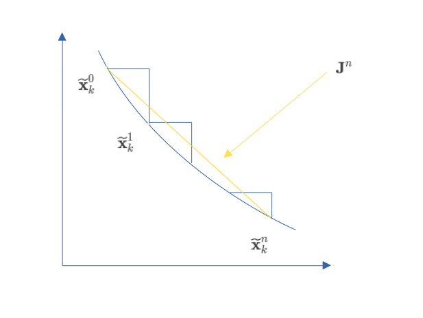

# 概率体素地图下的观测和状态更新

观测方程 $0 = \mathbf{h}_i(\mathbf{x}_k, \delta{\mathbf{p}}, \delta{\mathbf{q}}, \delta{\mathbf{u}})$ : 
$$
\begin{equation}
  \begin{aligned}
    0 &= {}^{G}\mathbf{u}_{I_k}^{T} ({}^{G}\mathbf{R}_{I_k} ( {}^{I}\mathbf{R}_L {}^{L}\mathbf{p}_j + {}^{I}\mathbf{p}_L ) + {}^{G}\mathbf{p}_{I_k} - {}^{G}\mathbf{q}_{j} )\\

    &= ( {}^{G}\hat{\mathbf{u}}_{I_k} \boxplus \delta{\mathbf{u}} )^{T} \left( {}^{G}\mathbf{\hat{R}}_{I_i} \boxplus {}^{G}\mathbf{\widetilde{\theta}}_{I_i} \left( {}^{I}\mathbf{\hat{R}}_{L} \boxplus {}^{I}\mathbf{\widetilde{\theta}}_{L} ( {}^{L}\mathbf{\hat{p}}_{j} + \delta{\mathbf{p}} ) + {}^{L}\mathbf{\hat{p}}_{L} \boxplus {}^{L}\mathbf{\widetilde{p}}_{L} \right) + {}^{G}\mathbf{\hat{p}}_{I_k} \boxplus {}^{G}\mathbf{\widetilde{p}}_{I_k} - {}^{G}\mathbf{\hat{q}}_{j} - \delta{\mathbf{q}} \right)
  \end{aligned}
\end{equation}
$$

其中法向量 $ \left[\delta{\mathbf{u}, \delta{\mathbf{q}}} \right] \sim N(0, \varSigma_{u,q} ) $ , 点 $\delta{\mathbf{p}} \sim N(0, \varSigma_p)$, 是通过这篇文章[Efficient and Probabilistic Adaptive Voxel Mapping for Accurate Online LiDAR Odometry](https://arxiv.org/pdf/2109.07082)给出，上式经过推导还是可以得出:

$$
\begin{equation}
  \begin{aligned}
    0 &\simeq \underbrace{{}^{G}\mathbf{\hat{u}}_{I_k}^{T} ({}^{G}\mathbf{\hat{R}}_{I_k} ( {}^{I}\mathbf{\hat{R}}_L  {}^{L}\mathbf{\hat{p}}_j + {}^{I}\mathbf{\hat{p}}_L ) + {}^{G}\mathbf{\hat{p}}_{I_k} - {}^{G}\mathbf{\hat{q}}_{j} )}_{\mathbf{h}_k(\mathbf{\hat{x}}_k, 0, 0, 0)} + \mathbf{H}_x \mathbf{\widetilde{x}}_x + \mathbf{H}_u \delta{\mathbf{u}} + \mathbf{H}_q \delta{\mathbf{q}} + \mathbf{H}_p \delta{\mathbf{p}} \\
    &= \mathbf{z}_k + \mathbf{H}_x \mathbf{\widetilde{x}}_k + \mathbf{v}_j 
  \end{aligned}
\end{equation}
$$

$$
\begin{equation}
  \begin{aligned}
    \mathbf{z}_k + \mathbf{H}_x \mathbf{\widetilde{x}}_k = -\mathbf{v}_j
  \end{aligned}
\end{equation}
$$

这里的 $\mathbf{z}_k$ 就是观测值, $\mathbf{H}_x$ 就是观测矩阵, $\mathbf{H}_u, \mathbf{H}_p, \mathbf{H}_q$ 就是服从正态分布的 $\delta{\mathbf{u}} , \delta{\mathbf{p}}, \delta{\mathbf{q}}$ 的转移矩阵. 这几个矩阵会在最后给出具体形式,暂时先不讨论. 这三者由于服从均值为0的正态分布, 线型变化后的 $\mathbf{v}_j$ 仍然服从均值为0的正态分布, 记作 $N(0, \mathbf{R}_j)$, 那么就可以用 $\mathbf{z}_k + \mathbf{H}_x \mathbf{\widetilde{x}}_k$ 构造最大后验估计:

$$
\begin{equation}
  \begin{aligned}
    \min_{\mathbf{\widetilde{x}_k}} \left( \| \mathbf{\widetilde{x}}_k \|_{\mathbf{P}_k}^{2} + \sum \| \mathbf{z}_k + \mathbf{H}_x \mathbf{\widetilde{x}}_k \|_{\mathbf{R}_j}^{2} \right)
  \end{aligned}
\end{equation}
$$

当然则是ESKF的步骤, 对于 IESKF, 其误差状态在迭代更新的时候不断在改变 $\mathbf{\widetilde{x}}_k^{n-1} \rightarrow \mathbf{\widetilde{x}}_k^{n} $ , 即此时观测的线型化点在不断改变(即上式中的 $\mathbf{H}_x$ 后的 $\mathbf{\widetilde{x}_k}$ 和 $\mathbf{x}_k \boxminus \mathbf{\hat{x}}_k $ 在不断改变), 此时的 $\mathbf{P}_k $ 已经不能表示它的状态分布了, 因此我们需要计算这种改变,重新推导 $\mathbf{P}_k$ .
$$
\begin{equation}
  \begin{aligned}
    
    \mathbf{\widetilde{x}}_k = \mathbf{x}_k \boxminus \mathbf{\hat{x}}_k = (\mathbf{\hat{x}}_k^{n} \boxplus \mathbf{\widetilde{x}}_k^{n}) \boxminus \mathbf{\hat{x}}_k^{0} \triangleq \mathbf{f}(\mathbf{x})|_{\mathbf{x} = \mathbf{\widetilde{x}}_{k}^{n}}
  \end{aligned}
\end{equation}
$$ 

在 $ \mathbf{x} = 0$ 处泰勒展开:

$$
\begin{equation}
  \begin{aligned}
    \mathbf{f}(\mathbf{\widetilde{x}}_k^n) = \mathbf{\hat{x}}_k^n \boxminus \mathbf{\hat{x}}_k^{0} + \mathbf{J}^n (\mathbf{\widetilde{x}}_k^n - 0)
  \end{aligned}
\end{equation}
$$

和论文内容一致,用一个图表示就是:

  

计算 $\mathbf{J}^n$:
$$
\begin{equation}
  \begin{aligned}
    \mathbf{J}^n = \left. \frac{\mathbf{f}(\mathbf{x})}{\partial \mathbf{x}} \right|_{\mathbf{x} = \mathbf{0}}
  \end{aligned}
\end{equation}
$$

这和下面形式等价:
$$
\begin{equation}
  \begin{aligned}
    \frac{\partial \left(\mathbf{a} \boxplus \mathbf{b} \right) \boxminus \mathbf{c}}{\partial \mathbf{b}}
  \end{aligned}
\end{equation}
$$

$$
\begin{equation}
  \begin{aligned}
    \mathbf{A} &= \left(\mathbf{a} \boxplus \mathbf{b} \right) \boxminus \mathbf{c} = \mathbf{Log}(\mathbf{c}^T \mathbf{a} \mathbf{Exp}(\mathbf{b}))\\
    \mathbf{Exp}(\mathbf{A}) &= \mathbf{c}^T \mathbf{a} \mathbf{Exp}(\mathbf{b}) \\
    \mathbf{Exp}(\mathbf{A} + \mathbf{\Delta{A}}) &= \mathbf{c}^T \mathbf{a} \mathbf{Exp}(\mathbf{b} + \delta{\mathbf{b}}) \\
    \mathbf{Exp}(\mathbf{A}) \mathbf{Exp}(\mathbf{J}_{rl} \mathbf{\Delta{A}}) &= \mathbf{c}^T \mathbf{a} \mathbf{Exp}(\mathbf{b}) \mathbf{Exp}(\mathbf{J}_{rr} \delta{\mathbf{b}}) \\ 
    \overset{两边消除}{\rightarrow} \mathbf{Exp}(\mathbf{J}_{rl} \mathbf{\Delta{A}}) &= \mathbf{Exp}(\mathbf{J}_{rr} \delta{\mathbf{b}}) \\
    \mathbf{J}_{rl} \mathbf{\Delta{A}} &= \mathbf{J}_{rr} \delta{\mathbf{b}}\\
    \frac{\Delta{\mathbf{A}}}{\delta{\mathbf{b}}} &= \frac{\mathbf{J}_{rr}}{\mathbf{J}_{rl}}
  \end{aligned}
\end{equation}
$$

即:

$$
\begin{equation}
  \begin{aligned}
    \mathbf{J}^n = \left. \frac{\mathbf{J}_r(\mathbf{x})} {\mathbf{J}_r((\mathbf{\hat{x}}_k^{n} \boxplus \mathbf{x}) \boxminus \mathbf{\hat{x}}_k^{0})} \right|_{\mathbf{x} = \mathbf{0}} = \mathbf{J}_r(\mathbf{\hat{x}}_k^{n} \boxminus \mathbf{\hat{x}}_k^0)^{-1}
  \end{aligned}
\end{equation}
$$:

$\mathbf{x}$在上一节 [前向传播](./前向传播.md) 中定义:
$$
\begin{equation}
  \begin{aligned}
    \mathbf{J}^n = \mathrm{x}\triangleq
    \begin{bmatrix}
     ^{G}\mathrm{p}_{I}^{T} & ^{G}\mathrm{R}_{I}^{T} & ^{I}\mathbf{R}_{L}^{T} & ^{I}\mathbf{p}_{L}^{T} & ^{G}\mathrm{v}_{I}^{T} & \mathrm{b}_{\boldsymbol{\omega}}^{T} & \mathbf{b}_{\mathbf{a}}^{T} & ^{G}\mathbf{g}^{T}
    \end{bmatrix}^{T}\in\mathcal{M}
  \end{aligned}
\end{equation}
$$

很容易得到 $\mathbf{J}^n$:
$$
\begin{equation}
  \begin{aligned}
  \begin{bmatrix}
  \mathbf{I}_{3\times3} & \mathbf{0} & \mathbf{0} & \mathbf{0} \\

  \mathbf{0} & \mathbf{J}_r(^{G}\mathrm{\hat{R}}_{I_k}^n \boxminus {}^{G}\mathrm{\hat{R}}_{I_k}^0)^{-1} & \mathbf{0} & \mathbf{0} \\

  \mathbf{0} & \mathbf{0} & \mathbf{J}_r(^{I}\mathrm{\hat{R}}_{L_k}^n \boxminus {}^{I}\mathrm{\hat{R}}_{L_k}^0)^{-1} & \mathbf{0} \\

  \mathbf{0} & \mathbf{0} & \mathbf{0} & \mathbf{I}_{14\times14}

  \end{bmatrix}_{23\times23}
  \end{aligned}
\end{equation}
$$

和论文中是一致的.

现在就可以改写最大后验估计了:

$$
\begin{equation}
  \begin{aligned}
    \min_{\mathbf{\widetilde{x}_k^n}} \left( \| \mathbf{\widetilde{x}}_k^n \|_{\mathbf{P}_k^n}^{2} + \sum \| \mathbf{z}_k^n + \mathbf{H}_x^{n} \mathbf{\widetilde{x}}_k^n \|_{\mathbf{R}_j}^{2} \right)
  \end{aligned}
\end{equation}
$$

这里 $\|\mathbf{x}\|_{\mathbf{M}}^2 = \mathbf{x}^T \mathbf{M}^{-1} \mathbf{x}$ ,这里带上标 $n$ 的都是在迭代过程中需要更新的量, 比较麻烦的就是这个更新, 利用最大后验证估计进行更新, 以后在推导吧,现在先引用王泽霖大佬的文章吧:
[FAST-LIO推导](https://zhuanlan.zhihu.com/p/587500859)

对于 $\mathbf{H}_u, \mathbf{H}_q, \mathbf{H}_p$ 的推导和之前一样,都是另其他分量为 0,很容易求得:
$$
\begin{equation}
  \begin{aligned}
    \mathbf{H}_u = \left( {}^{G}\mathbf{\hat{R}}_{I_k} ( {}^{I}\mathbf{\hat{R}}_L {}^{L}\mathbf{\hat{p}}_j + {}^{I}\mathbf{\hat{p}}_L ) + {}^{G}\mathbf{\hat{p}}_{I_k} - {}^{G}\mathbf{\hat{q}}_{j} \right)^T
  \end{aligned}
\end{equation}
$$

$$
\begin{equation}
  \begin{aligned}
    \mathbf{H}_q = {}^{G}\mathbf{u}_{I_k}^T
  \end{aligned}
\end{equation}
$$

$$
\begin{equation}
  \begin{aligned}
    \mathbf{H}_p = {}^{G}\mathbf{u}_{I_k}^T {}^{G}\mathbf{\hat{R}}_{I_k} {}^{I}\mathbf{\hat{R}}_L
  \end{aligned}
\end{equation}
$$

即测量噪声 $\mathbf{v}_j$ 的协方差 $\mathbf{R}_{j}$就为：
$$
\begin{equation}
  \begin{aligned}
    \begin{bmatrix} \mathbf{H}_u & \mathbf{H}_q & \mathbf{H}_p \end{bmatrix}
    \mathbf{diag}(\varSigma_{u,q}, \varSigma_{p}) 
    \begin{bmatrix} \mathbf{H}_u^T \\ \mathbf{H}_q^T \\ \mathbf{H}_p^T \end{bmatrix}
  \end{aligned}
\end{equation}
$$

## 注意
这篇文章[Efficient and Probabilistic Adaptive Voxel Mapping for Accurate Online LiDAR Odometry](https://arxiv.org/pdf/2109.07082) 激光雷达点的不确定性在转移到全局坐标系的过程中用的是状态变量的协方差，而IESKF并没有维护这个状态变量的协方差，只维护了误差状态变量的协方差，在这里讨论是否需要重新计算论中的公式(18)：

$$
\begin{equation}
  \begin{aligned}

  \mathbf{\Sigma}_{{}^G{\mathbf{p}_j}}&={}^G\mathbf{R}_L\mathbf{\Sigma}_{L_{\mathbf{p}_j}} {}^G\mathbf{R}_L^T+ {}^G\mathbf{R}_L\lfloor^L\mathbf{p}_j\rfloor_\times\mathbf{\Sigma}_{\mathbf{R}}\lfloor^L\mathbf{p}_j\rfloor_{\times}^T{}^{G}\mathbf{R}_L^T+\mathbf{\Sigma}_{\mathbf{t}}
   
  \end{aligned}
\end{equation}
$$

由于：
$$
\begin{equation}
  \begin{aligned}
    {}^{G}\mathbf{p}_j &=  {}^{G}\mathbf{R}_{I_k} ( {}^{I}\mathbf{R}_L {}^{L}\mathbf{p}_j + {}^{I}\mathbf{p}_L ) + {}^{G}\mathbf{p}_{I_k}   \\

    &= ({}^{G}\mathbf{\hat{R}}_{I_i} \boxplus {}^{G}\mathbf{\widetilde{\theta}}_{I_i}) \left( {}^{I}\mathbf{\hat{R}}_{L} \boxplus {}^{I}\mathbf{\widetilde{\theta}}_{L} ( {}^{L}\mathbf{\hat{p}}_{j} + \delta{\mathbf{p}} ) + {}^{L}\mathbf{\hat{p}}_{L} \boxplus {}^{L}\mathbf{\widetilde{p}}_{L} \right) + {}^{G}\mathbf{\hat{p}}_{I_k} \boxplus {}^{G}\mathbf{\widetilde{p}}_{I_k} \\

  \end{aligned}
\end{equation}
$$

显然 ${}^{G}\mathbf{p}_j$ 的协方差由 $\varSigma_{{}^{I}\mathbf{R}_L}, \varSigma_{{}^{G}\mathbf{R}_{I_i}}$ 组成,
分别对 ${}^{G}\mathbf{\widetilde{\theta}}_{I_i}, {}^{I}\mathbf{\widetilde{\theta}}_{L}$ 求导, 如果在 $\mathbf{\widetilde{x}}_i = 0$ 进行一阶泰勒展开，因此可以直接用误差状态变量的协方差代替状态变量的协方差, 但是如果需要更精确的结果，展开点不在 $\mathbf{\widetilde{x}}_i = 0$ 就需要重新计算。
由于多了一个 ${}^{I}\mathbf{R}_L$ 结果也和论文不一致，但是从$L_i \to I_i \to G$这个过程可以看作是一个迭代的过程,因此递归一下就好了:
$$
\begin{equation}
  \begin{aligned}

  \mathbf{\Sigma}_{{}^I{\mathbf{\hat{p}}_j}}&={}^I\mathbf{\hat{R}}_{L_i}\mathbf{\Sigma}_{^L{\mathbf{p}_j}} {}^I\mathbf{\hat{R}}_{L_i}^T+ {}^I\mathbf{\hat{R}}_{L_i}\lfloor^L\mathbf{p}_j\rfloor_\times\mathbf{\Sigma}_{^I\mathbf{\hat{R}}_{L_i}}\lfloor^L\mathbf{p}_j\rfloor_{\times}^T{}^{I}\mathbf{\hat{R}}_{L_i}^T+\mathbf{\Sigma}_{{}^I\mathbf{\hat{p}}_{L_i}} \\

  {}^{I_i}\mathbf{\hat{p}}_j &= {}^{I}\mathbf{\hat{R}}_{L_i} {}^L\mathbf{p}_j + {}^I\mathbf{\hat{p}}_{L_i}\\
   
  \mathbf{\Sigma}_{{}^G{\mathbf{\hat{p}}_j}}&={}^G\mathbf{\hat{R}}_{I_i}\mathbf{\Sigma}_{^{I_i}{\mathbf{\hat{p}}_j}} {}^G\mathbf{\hat{R}}_{I_i}^T+ {}^G\mathbf{\hat{R}}_{I_i}\lfloor^{I_i}\mathbf{\hat{p}}_j\rfloor_\times\mathbf{\Sigma}_{^G\mathbf{\hat{R}}_{I_i}}\lfloor{}^{I_i}\mathbf{\hat{p}}_j\rfloor_{\times}^T{}^{G}\mathbf{\hat{R}}_{I_i}^T+\mathbf{\Sigma}_{{}^G\mathbf{p}_{I_i}}

  \end{aligned}
\end{equation}
$$

